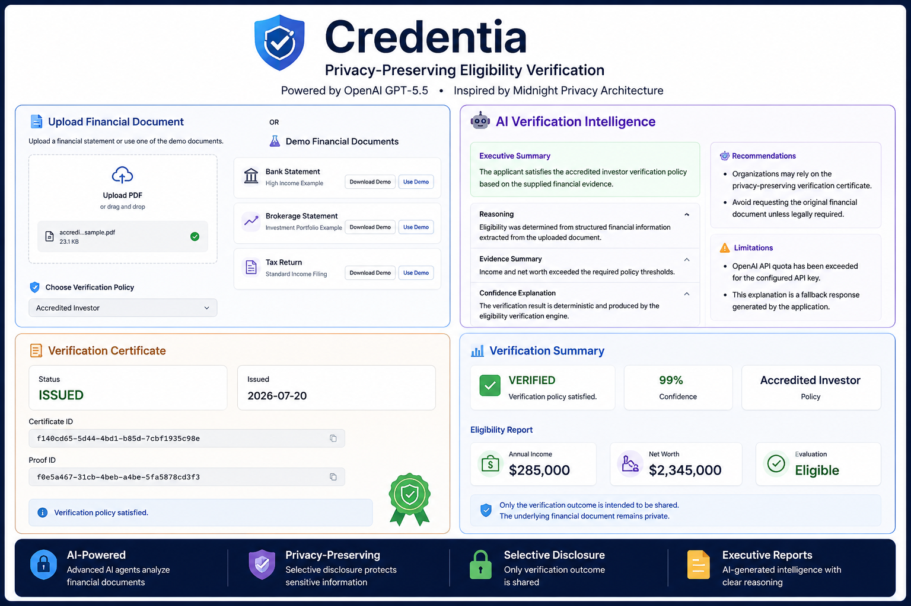
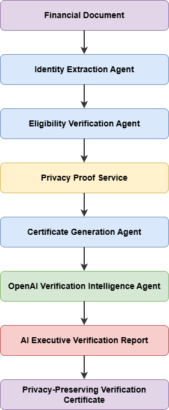

# 🛡 Credentia

> 🏆 **OpenAI Build Week 2026 Submission**
>
> This branch (`feature/openai-build-week-2026`) extends Credentia with OpenAI-powered Verification Intelligence. The project was developed with Codex and uses OpenAI GPT-5.6 to generate structured, explainable verification reports while preserving Credentia's privacy-first verification architecture.

AI-powered verification using **OpenAI GPT-5.6**

Originally built for the Midnight Network Hackathon and extended during **OpenAI Build Week 2026** with structured AI verification intelligence.

---

## 🌐 Live Demo

- **OpenAI Build Week Edition:** https://openai.credentia.gotihub.com
- **Original Credentia:** https://credentia.gotihub.com
- **API Documentation:** https://openai.credentia.gotihub.com/docs

---

## 📸 Product Walkthrough



The walkthrough highlights the complete privacy-preserving verification journey:

- 🏠 Hero Experience
- 📄 Financial Document Upload
- 🤖 AI Verification Pipeline
- 📜 Privacy-Preserving Verification Certificate
- 🤖 AI Verification Intelligence Report

---

# 🚀 Platform Vision

Credentia is a configurable **privacy-preserving verification platform** designed to verify eligibility without exposing sensitive personal information.

While this demonstration focuses on **Accredited Investor Verification**, the underlying architecture is reusable across multiple verification domains by combining AI-assisted document understanding with privacy-first verification principles inspired by Midnight.

Future verification policies include:

- 🪪 Identity Verification
- 🏢 Employment Verification
- 💰 Proof of Funds
- 🌍 Residency Verification
- 🎓 Education Verification
- 💼 Professional Certification


Each verification policy leverages the same selective disclosure engine while minimizing unnecessary exposure of sensitive data.

---

# 🤖 AI Verification Intelligence

OpenAI GPT-5.6 transforms deterministic verification results into a structured executive report without changing the verification decision.

The AI layer explains:

- Executive Summary
- Verification Reasoning
- Evidence Summary
- Confidence Analysis
- Recommendations
- Limitations

The verification outcome remains deterministic while AI improves explainability for end users.

---

# 🧠 OpenAI Technologies

Credentia combines two OpenAI technologies during development:

### 💻 Codex

Codex accelerated the implementation of the project throughout OpenAI Build Week by assisting with:

- Backend architecture
- FastAPI implementation
- Verification Intelligence Agent
- API refactoring
- Streamlit UI improvements
- Deployment and infrastructure
- Documentation and developer experience

### 🤖 OpenAI GPT-5.6

GPT-5.6 powers the Verification Intelligence Agent, transforming deterministic verification results into structured executive reports containing:

- Executive summaries
- Verification reasoning
- Evidence summaries
- Confidence analysis
- Recommendations
- Limitations

Together, Codex accelerated development while GPT-5.6 enhanced the explainability of verification results.

---
## 🚀 OpenAI Build Week Contribution

This OpenAI Build Week edition introduces:

- Reusable OpenAI client
- Provider abstraction
- Structured Outputs
- Verification Intelligence Agent
- AI-generated executive verification reports
- Explainable verification summaries
- Development accelerated with Codex

> **Repository Note**
>
> The OpenAI Build Week implementation is available on the
> `feature/openai-build-week-2026` branch while the `main` branch remains stable.

---

# 🌙 Why Midnight

Traditional verification workflows often require users to disclose complete financial documents containing sensitive personal information.

Credentia is built around Midnight's privacy-first philosophy by verifying eligibility while minimizing the disclosure of confidential financial data.

Instead of sharing the underlying financial document, users receive a **privacy-preserving verification certificate** that organizations can trust while sensitive financial information remains protected.

During **OpenAI Build Week 2026**, Credentia was extended with an AI-powered Verification Intelligence layer using **OpenAI GPT-5.6**. This enhancement improves transparency by generating structured explanations of verification outcomes while preserving the deterministic verification process and privacy-first architecture.

Privacy remains the foundation of the platform. AI enhances explainability without increasing exposure of sensitive user data.

---

# 🔐 Privacy Proof Layer

Credentia separates eligibility verification from proof generation through a dedicated **Privacy Proof Service**.

After eligibility is evaluated, a deterministic proof commitment is generated from the verification outcome without embedding sensitive financial information.

The proof generation process is encapsulated behind a **Midnight Network Adapter**, allowing the current demonstration to simulate a privacy-preserving verification workflow while remaining ready for future native Midnight integrations.

This architecture keeps business logic independent from the underlying proof provider and supports future evolution without requiring application redesign.

---

# 🏗 Architecture



---

# ⚙️ Verification Workflow

```text
Upload Financial Document
        │
        ▼
AI Document Understanding
        │
        ▼
Identity Extraction
        │
        ▼
Eligibility Evaluation
        │
        ▼
Privacy Proof Generation
        │
        ▼
Verification Certificate
        │
        ▼
OpenAI Verification Intelligence
        │
        ▼
Executive Verification Report
```

---

# ✨ Features

- 🤖 OpenAI GPT-5.6 Verification Intelligence
- 📋 Executive Verification Reports
- 🧠 Explainable AI Verification
- 🔐 Privacy-Preserving Verification
- 🤖 AI-Assisted Document Understanding
- 📄 Financial Document Processing
- 👤 Identity Extraction
- ✅ Eligibility Verification
- 🔐 Privacy Proof Generation
- 📜 Verification Certificate Generation
- 🌙 Midnight Adapter Architecture
- 🔒 Selective Disclosure
- ⚡ FastAPI Backend
- 🎨 Streamlit User Interface
- 📊 Downloadable Verification Reports

---

# 🛠 Technology Stack

### Backend

- FastAPI
- Pydantic
- PyMuPDF
- pdfplumber

### Frontend

- Streamlit

### AI

- OpenAI GPT-5.6
- Structured Outputs
- Multi-Agent Verification Pipeline

### Platform

- Midnight Network Hackathon

---

# 📋 Supported Verification Policies

## Current Demonstration

- ✅ Accredited Investor Verification

## Planned Policies

- 🪪 Identity Verification
- 🏢 Employment Verification
- 💰 Proof of Funds
- 🌍 Residency Verification
- 🎓 Education Verification
- 💼 Professional Certification

---

# 📂 Repository Structure

```text
src/
├── agents/
│   ├── identity_agent.py
│   ├── eligibility_agent.py
│   ├── certificate_agent.py
│   └── verification_intelligence_agent.py
│
├── core/
│   ├── ai_client.py
│   └── orchestrator.py
│
├── providers/
│   └── openai.py
│
├── prompts/
│   └── verification_intelligence.py
│
├── models/
│   └── intelligence.py
│
├── api/
│   └── routes.py
│
└── ui/
```

---

# 🚀 Getting Started

```bash
# Clone the repository
git clone https://github.com/apurba-labs/credentia.git

cd credentia

# Checkout the OpenAI Build Week submission
git checkout feature/openai-build-week-2026

# Install dependencies
uv sync

# Start the FastAPI backend
uv run uvicorn main:app --reload

# In another terminal, start the Streamlit UI
uv run streamlit run src/ui/app.py
```

---

# 📄 License

MIT License

---

# ❤️ Built For

**OpenAI Build Week 2026**

Built with:

- 💻 Codex
- 🤖 OpenAI GPT-5.6
- 🌙 Midnight-inspired Privacy Architecture

Originally created during the **Midnight Network Hackathon 2026** and extended during **OpenAI Build Week 2026**.


🤖 OpenAI GPT-5.6 Verification Intelligence

🌙 Privacy-first architecture inspired by Midnight

🔐 Selective Disclosure by Design

Open Source by **Gotihub**

© 2026 Gotihub